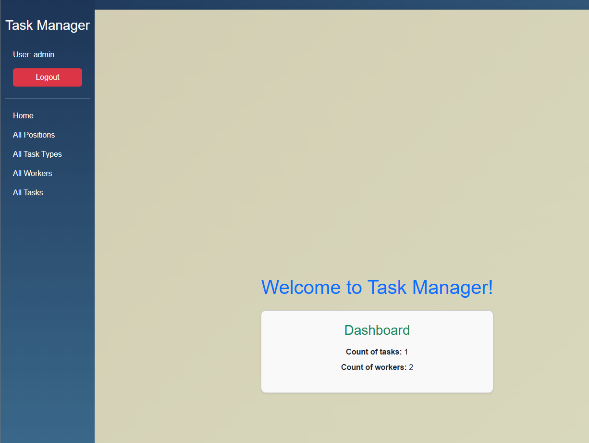

# Task manager project

## Project about task manager. 
You can create worker who works on certain position.
 You can add new task and put some information about it, choose task type

## Installation
Python 3.12 must be already installed

```shell
git clone https://github.com/DHlomozda/task-manager.git
cd task_manager_project
pyhton -m venv .venv
venv\Scripts\Activate
pip install -r requirements.txt
python manage.py runserver # starts Django server
```

## Features
* Sign up functionality for Worker
* Managing task

## Demo
